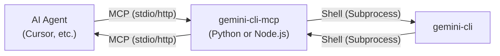

# `gemini-cli-mcp`

> **Quickstart for End Users:**
>
> **Install via PyPI (Python):**
> ```sh
> pip install gemini-cli-mcp
> ```
> **Install via npm (Node.js):**
> ```sh
> npm install -g gemini-cli-mcp-server
> ```
>
> **MCP Client Configuration:**
> - Set the `command` in your MCP client (e.g., Cursor, Claude Desktop) to the absolute path of the installed `gemini-cli-mcp` executable.
> - Do **not** point to a local script or source file unless you are developing or debugging.
>
> For advanced usage, development, or troubleshooting, see the implementation-specific README files in `server_py/` (Python) or `server_node/` (Node.js).

> **Authentication Requirement:**
> 
> Before using this server, you must either:
> - Log in to `gemini-cli` (e.g., by running `gemini login`) to maintain an active login session, **or**
> - Set your Gemini API key as the `GEMINI_API_KEY` environment variable.
>
> Without authentication, the server will not be able to invoke `gemini-cli` commands successfully.

`gemini-cli-mcp` is a server that bridges the **Model Context Protocol (MCP)** with the locally installed `gemini-cli`. It allows modern AI agents, such as Cursor and Claude Desktop, to use `gemini-cli`'s powerful features as Tools.

This server enables invoking key `gemini-cli` functionalities—including `ask`, ~~`agent`, `commit`, and `pr`~~ —directly from your AI agent.

## 1. Project Overview

This project aims to provide a seamless integration between AI agents and `gemini-cli`, supporting multiple languages and environments to maximize developer experience.

### Goals

*   **MCP Compliance:** Fully adhere to the MCP specification for stable integration.
*   **Tool Abstraction:** Expose core `gemini-cli` commands as MCP Tools.
*   **Multi-language & Multi-environment Support:** Provide implementations in Python and Node.js, supporting `stdio`, `http`, and `Docker`.
*   **Effortless Deployment:** Distribute via `pip` (PyPI) and `npm`.

### Architecture



## 2. Implementations

This project provides separate, language-specific implementations. Please refer to the `README.md` file within each implementation directory for detailed setup and usage instructions.

*   **[Python](./server_py/README.md)**: A server built with FastAPI.
*   **Node.js**: (Coming soon)

## 3. MCP Tool Reference

The server exposes `gemini-cli` commands as MCP tools. The core logic involves wrapping `gemini-cli` commands based on the tool called.

### Available Tools

| Tool Name           | Description                                                              | Main Params                                                  |
| ------------------- | ------------------------------------------------------------------------ | ------------------------------------------------------------ |
| `gemini_ask`        | Ask a question in Ask mode.                                              | `question` (string)                                          |
| `gemini_agent`      | Run a prompt in Agent mode with auto-execution.                          | `prompt` (string)                                            |
| ~~`gemini_git_commit`~~ | ~~Generate a conventional commit message and perform `git commit`.~~        | ~~`branch_name` (string, optional)~~                             |
| ~~`gemini_git_pr`~~     | ~~Automatically commit, push, and create a PR.~~                             | ~~`commit_message`, `branch_name`, `pr_title` (all optional strings)~~ |
| ~~`gemini_git_diff`~~   | ~~Summarize code changes using Gemini AI.~~                                  | ~~`diff_args` (string, optional)~~                               |

### Command Translation Example

*   `gemini_ask` → `gemini ask --model {model} --all_files --sandbox --prompt "{question}"`
*   `gemini_agent` → `gemini agent --model {model} --all_files --sandbox --yolo --prompt "{prompt}"`

## 4. MCP Client Configuration & Usage

**No need to start the server manually**
- The MCP client will launch the process and communicate via STDIO.
- Just register the following configuration.

#### Cursor, Windsurf Example
```json
// cursor: $HOME/.cursor/mcp.json
// windwurf: $HOME/.codeium/windsurf/mcp_config.json
{
  "mcpServers": {
    "gemini-cli-mcp": {
      "type": "stdio",
      "command": "gemini-cli-mcp", // gemini-cli-mcp-server for node
      "env": {
        "GEMINI_MODEL": "gemini-2.5-flash",
        "PROJECT_ROOT": "/path/to/project_root"
      }
    }
  }
}
```

#### Claude Code Example
```json
// Settings > Developer > Edit Config > claude_desktop_config.json
// find command location with `which gemini-cli-mcp`
// MUST provide a Gemini API key to use with Claude Desktop
{
  "mcpServers": {
    "gemini-cli-mcp": {
      "command": "/path/to/bin/gemini-cli-mcp", // gemini-cli-mcp-server for node
      "args": [],
      "env": {
        "GEMINI_API_KEY": "your_api_key",
        "GEMINI_MODEL": "gemini-2.5-flash",
        "PROJECT_ROOT": "/path/to/project_root"
      }
    }
  }
}
```

## 5. Development Roadmap

-   [x] **Phase 1: Python MVP**
    -   [x] Implement `gemini_ask` and `gemini_agent` tools.
    -   [x] Complete `stdio` and `http` modes.
    -   [x] Finalize environment variable handling.
-   [ ] ~~**Phase 2: Git Tools & Containerization**~~
    -   ~~[ ] Implement `gemini_git_commit`, `pr`, and `diff` tools in Python.~~
    -   ~~[ ] Create and test the `Dockerfile`.~~
    -   ~~[ ] Perform test deployments to PyPI.~~
-   [ ] **Phase 3: Node.js Porting & Distribution**
    -   [ ] Implement all features in Node.js.
    -   [ ] Package and deploy to npm.
    -   [ ] Register on `Smithery.ai`.
-   [ ] **Phase 4: Documentation & Stabilization**
    -   [ ] Write comprehensive `README.md` files for all implementations.
    -   [ ] Conduct cross-platform testing and bug fixes.

## 6. Risks & Mitigation

*   **Risk:** The `gemini-cli` command-line interface changes, breaking the 
server.
    *   **Mitigation:** Pin the server to a specific version of `gemini-cli` 
    and use integration tests to detect breaking changes.
*   **Risk:** Exceptions arise due to the user's local `git` configuration.
    *   **Mitigation:** Add pre-flight checks for `git` and return clear 
    error messages.